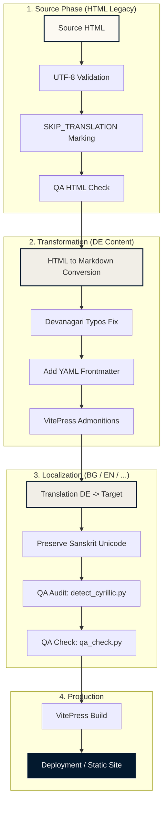

# 🎓 Content Quality Standards & Transformation Guidelines

This document defines the quality criteria and testing procedures for adding new content to the Sanskrit Course project, ensuring a seamless transformation from legacy HTML sources and high-integrity Markdown production.

---

## 🗺️ 0. Transformation Workflow Visualization

The following diagram illustrates the complete lifecycle of a lesson, from the legacy HTML source to multi-language production-ready Markdown.



---


## 🏗️ 1. Standards for Source HTML (Legacy Integration)

New HTML pages intended for Markdown transformation must adhere to these structural rules to minimize manual correction after conversion.

### A. Encoding & Purity
*   **Encoding**: All files MUST be saved as **UTF-8**.
*   **Devanagari**: Use standard Unicode Devanagari. Avoid legacy font hacks (e.g., using Latin characters with a specific font to look like Sanskrit).
*   **Character Set**: Audit for hidden Cyrillic/Greek injections using `detect_cyrillic.py`.

### B. Structural Marking
*   **Redundancy Filter**: Use the `<!-- SKIP_TRANSLATION_START -->` and `<!-- SKIP_TRANSLATION_END -->` markers to wrap manual "Overview" (navigation) lists, as VitePress generates these dynamically from headers.
*   **Heading Hierarchy**: Ensure the main title is `<h1>`. Sub-sections must follow logical order (`<h2>`, `<h3>`).

### C. Tables & Media
*   **Tables**: Use standard `<table>`, `<tr>`, `<td>` tags. Avoid nested tables for complex grammar paradigms; use multiple simple tables instead.
*   **Images**: Use ``. The `alt` text should describe the image content for accessibility.
*   **Relative Paths**: Media references should ideally use paths that will be consistent after migration (e.g., `/images/filename.jpg`).

---

## ✍️ 2. Standards for Direct Markdown (Native Content)

Files created directly in Markdown must follow the **"Scholarly Synthesis"** design system defined in `AGENTS.md`.

### A. Document Structure
*   **One H1**: Each file must have exactly one `# Heading 1`.
*   **Admonitions**: Use VitePress custom containers for pedagogical context:
    *   `::: info` (General information/Rights)
    *   `::: tip` (Grammar rules/Tips)
    *   `::: warning` (Common mistakes)
*   **Formatting**: Use `*italics*` for transliteration (IAST) and `**bold**` for Sanskrit terms in text.

### B. Technical Requirements
*   **Internal Links**: Use relative paths without the `.md` extension (e.g., `[Lektion 4](/lektionen/lektion04)`).
*   **Devanagari Audit**: Run the `detect_cyrillic.py` script on all new files to ensure character-set purity.
*   **Image Storage**: Save all images in `docs/public/images/` and reference them as `/images/filename.jpg`.

---

## 🛠️ 3. Quality Assurance & Tests

Before merging any new content, the following automated and manual checks must pass:

| Check | Tool / Method | Objective |
| :--- | :--- | :--- |
| **Build Integrity** | `npm run docs:build` | Ensure no syntax errors or unclosed tags. |
| **Character Audit** | `python detect_cyrillic.py` | Eliminate mixed-script bugs in Devanagari. |
| **Parity Check** | Manual/AI Review | Compare MD output vs HTML source for missing tables/rules. |
| **Link Integrity** | VitePress build logs | Ensure no broken internal/external links. |

---

## 📑 4. YAML Frontmatter Strategy

Integrating YAML Frontmatter at the top of every Markdown file will significantly increase the system's "intelligence" and ease of maintenance.

### Proposed Schema
```yaml
---
title: "Lektion 5"
subtitle: "Nominalkomposita"
lesson_id: 5
category: "Grammatik"
status: "stable" # draft | review | stable
last_reconstructed: 2026-04-29
---
```

### 💎 Quality Gains:
1.  **Automated Navigation**: Frontmatter allows us to automatically generate "Next/Previous" lesson buttons and dynamic Sidebars without manual JSON editing.
2.  **SEO & Search**: Provides high-quality metadata for search engines and the internal VitePress search index.
3.  **Auditability**: Scripts can instantly generate a "Roadmap Status Report" by scanning the `status` and `last_reconstructed` fields.
4.  **UI Flexibility**: We can use the `subtitle` to display the Sanskrit name of the lesson in the header automatically.

---

## 🚀 Implementation Plan for V1.3

1.  **Retrofit Frontmatter**: Systematically add YAML blocks to Lessons 1-61.
2.  **Update Config**: Modify `docs/.vitepress/config.mjs` to leverage frontmatter-based navigation.
3.  **Automate QA**: Integrate `detect_cyrillic.py` into a pre-commit or build-step hook.
