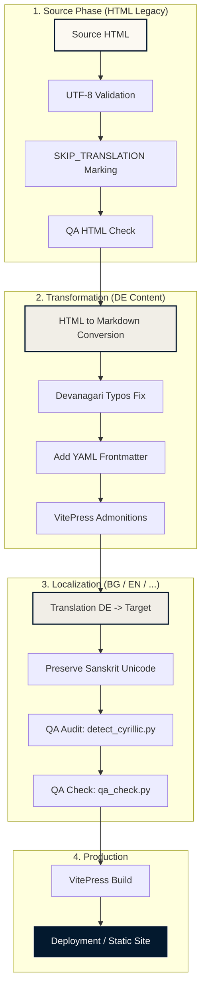

# 🎓 Content Quality Standards & Transformation Guidelines

This document defines the quality criteria and testing procedures for adding new content to the Sanskrit Course project, ensuring a seamless transformation from legacy HTML sources and high-integrity Markdown production.

---

## 🗺️ 0. Transformation Workflow Visualization

The following diagram illustrates the complete lifecycle of a lesson, from the legacy HTML source to multi-language production-ready Markdown.



---


## 🏗️ 1. Standards for Source HTML (Legacy Integration)

New HTML pages intended for Markdown transformation must adhere to these structural rules to minimize manual correction after conversion.

### A. Encoding & Purity
*   **Encoding**: All files MUST be saved as **UTF-8**.
*   **Devanagari**: Use standard Unicode Devanagari. Avoid legacy font hacks (e.g., using Latin characters with a specific font to look like Sanskrit).
*   **Character Set**: Audit for hidden Cyrillic/Greek injections using `detect_cyrillic.py`.

### B. Structural Marking
*   **Redundancy Filter**: Use the `<!-- SKIP_TRANSLATION_START -->` and `<!-- SKIP_TRANSLATION_END -->` markers to wrap manual "Overview" (navigation) lists, as VitePress generates these dynamically from headers.
*   **Heading Hierarchy**: Ensure the main title is `<h1>`. Sub-sections must follow logical order (`<h2>`, `<h3>`).

### C. Tables & Media
*   **Tables**: Use standard `<table>`, `<tr>`, `<td>` tags. Avoid nested tables for complex grammar paradigms; use multiple simple tables instead.
*   **Images**: Use ``. The `alt` text should describe the image content for accessibility.
*   **Relative Paths**: Media references should ideally use paths that will be consistent after migration (e.g., `/images/filename.jpg`).

---

## ✍️ 2. Standards for Direct Markdown (Native Content)

Files created directly in Markdown must follow the **"Scholarly Synthesis"** design system defined in `AGENTS.md`.

### A. Document Structure
*   **One H1**: Each file must have exactly one `# Heading 1`. This title should be minimal (e.g., `# Lektion 61`). Detailed thematic descriptions belong in the `subtitle` frontmatter field.
*   **Admonitions**: Use VitePress custom containers for pedagogical context:
    *   `::: info` (General information/Rights)
    *   `::: tip` (Grammar rules/Tips)
    *   `::: warning` (Common mistakes)
*   **Formatting**: Use `*italics*` for transliteration (IAST) and `**bold**` for Sanskrit terms in text.

### B. Technical Requirements
*   **Internal Links**: Use relative paths without the `.md` extension (e.g., `[Lektion 4](/lektionen/lektion04)`).
*   **Devanagari Audit**: Run the `detect_cyrillic.py` script on all new files to ensure character-set purity.
*   **Image Storage**: Save all images in `docs/public/images/` and reference them as `/images/filename.jpg`.

---


## 🛡️ 2.5. Safety Instructions for Content Integrity

To prevent the accidental omission of entire sections or tables during the transformation from legacy HTML to Markdown, the following safety procedures must be followed:

### A. Section Mapping (The Checklist Method)
*   **Inventory First**: Before starting the conversion, extract the table of contents (Übersicht) from the source HTML.
*   **Header Parity**: Verify that the number of `<h2>` and `<h3>` headers in the source matches the number of `##` and `###` headers in the target Markdown.
*   **Verification**: Cross-reference each section of the inventory against the final Markdown.

### B. Keyword & Symbol Validation
*   **Term Check**: Perform a text search in the final Markdown for key technical terms from the source Übersicht (e.g., specific grammar terms like "periphrastische Futur" or "लुट्").
*   **Symbol Audit**: Ensure that critical symbols (Sanskrit characters, specific markers) are present in the target.

### C. Visual Parity Check (Pro-Sync)
*   **Side-by-side Review**: Use the **Ultimate QA Viewer** (`/qa/viewer.html`) to scroll through both versions simultaneously.
*   **Structural Gaps**: Look for sudden layout changes or large text blocks in the source that are not present in the target. **Pay special attention to images located between sections.**

### D. Image Inventory Audit
*   **Source Scan**: Extract all `` src paths from the source HTML.
*   **Target Verification**: Ensure every source image has a corresponding `/images/lektXXXX.jpg` reference in the Markdown.
*   **No Orphans**: Any image in the source that is not in the target must be explicitly documented as "intentionally removed" (e.g., redundant logos).

### E. Semantic Normalization (Hierarchy Check)
*   **Logical Mapping**: Do NOT trust the original HTML tags (e.g., `<p><b>` might be a header, `<h2>` might be a sub-header). Map sections based on their logical relationship (Subject -> Sub-subject -> Detail).
*   **Header Levels**:
    *   **Rule**: All headers MUST use the **Lesson-Prefix Numbering** (e.g., `60.1.`, `60.5.2.`).
    *   **Reason**: While the original Payer HTML often uses relative numbering (e.g., `1.`, `2.`), the digital VitePress environment requires absolute lesson context in headers for global search, cross-linking, and navigation consistency.
    *   **Levels**:
        *   `## XX.Y.` (H2) for main course sections (where XX is the lesson number).
        *   `### XX.Y.Z.` (H3) for direct children.
        *   `### XX.Y.Z.` (H3) for direct children.
        *   `#### XX.Y.Z.W.` (H4) for nested details.
    *   **Anti-Pattern Warning**: NEVER use relative numbering from the source (e.g., `### 4.1.`). It MUST always be prefixed with the lesson ID (e.g., `### 61.4.1.`).
*   **Header Separation**:
    *   **Rule**: EVERY header of EVERY level (except the main H1 at the top) MUST be preceded by a horizontal line (`---`) and a blank line.
    *   **Reason**: This creates a clean, editorial layout with clear visual separation between scholarly sections.
    *   **Example**:
      ```markdown
      ... content ...

      ---

      ## 7.2. Der Akkusativ
      ```
*   **Semantic Parity (Header vs. Label)**:
    *   **Rule**: The Markdown hierarchy MUST strictly follow the original HTML tag types.
    *   **Labels**: If a functional description (e.g., "Paradigma", "Beispiele", "Bildung von...") is a paragraph (`<p>`) or bold text (`<b>`) in the original HTML, it MUST be a **bold paragraph** (`**...**`) in Markdown.
    *   **Headers**: Only elements that are actual header tags (`<h1>`-`<h6>`) in the source HTML may be transformed into Markdown headers (`#`, `##`, `###`).
    *   **Reason**: Functional labels for tables or examples are instructional context, not structural divisions. Using headers for them bloats the table of contents and breaks the scholarly editorial flow.

*   **Numerical Alignment**: Numbering must reflect the hierarchy. If a parent is removed/demoted, children must be renumbered (e.g., 61.3.1.1 becomes 61.3.1).
*   **Completeness Verification**:
    - All top-level sections (H1 in original) must be represented as H2 in Markdown.
    - No major functional block (e.g., "Benediktiv", "Konditionalis") may be skipped.
*   **Image Audit**:
    - Every `` in the original HTML must be present in the Markdown.
    - Use the standard image block format:
      ```markdown
      ::: media
      
      Abb.: ...
      (Bildquelle: [Details](/licenses#lektXXYY))
      :::
      ```

---

## 🛠️ 3. Quality Assurance & Tests

Before merging any new content, the following automated and manual checks must pass:

| Check | Tool / Method | Objective |
| :--- | :--- | :--- |
| **Build Integrity** | `npm run docs:build` | Ensure no syntax errors or unclosed tags. |
| **Character Audit** | `python detect_cyrillic.py` | Eliminate mixed-script bugs in Devanagari. |
| **Parity Check** | Manual/AI Review | Compare MD output vs HTML source using Section Mapping. |
| **Visual Sync** | QA Viewer | Side-by-side scrolling to spot structural gaps. |
| **Link Integrity** | VitePress build logs | Ensure no broken internal/external links. |

---

## 📑 4. YAML Frontmatter Strategy

Integrating YAML Frontmatter at the top of every Markdown file will significantly increase the system's "intelligence" and ease of maintenance.

### Proposed Schema
```yaml
---
title: "Lektion 5"
subtitle: "Nominalkomposita"
lesson_id: 5
category: "Grammatik"
status: "stable" # draft | review | stable
last_reconstructed: 2026-04-29
---
```

### 💎 Quality Gains:
1.  **Automated Navigation**: Frontmatter allows us to automatically generate "Next/Previous" lesson buttons and dynamic Sidebars without manual JSON editing.
2.  **SEO & Search**: Provides high-quality metadata for search engines and the internal VitePress search index.
3.  **Auditability**: Scripts can instantly generate a "Roadmap Status Report" by scanning the `status` and `last_reconstructed` fields.
4.  **UI Flexibility**: We can use the `subtitle` to display the Sanskrit name of the lesson in the header automatically.

---

## 🚀 Implementation Plan for V1.3

1.  **Retrofit Frontmatter**: Systematically add YAML blocks to Lessons 1-61.
2.  **Update Config**: Modify `docs/.vitepress/config.mjs` to leverage frontmatter-based navigation.
3.  **Automate QA**: Integrate `detect_cyrillic.py` into a pre-commit or build-step hook.

---

## 🛡️ 2.6. Image Parity Lock (Schutz vor Fehlzuordnungen)

Um „Verschlimmbesserungen“ bei der Bildzuordnung zu verhindern, gilt für alle Transformationen:

1.  **Kontext-Validierung**: Ein Bild darf niemals ohne Prüfung des umgebenden Textes verschoben werden. Die inhaltliche Verknüpfung (z.B. Schlange -> Intensivum/Bewegung) ist maßgeblich.
2.  **Dateinamen-Abgleich**: Da die Dateinamen generisch sind (z.B. `lekt6104.jpg`), muss die Zuordnung zwingend gegen die Bildunterschrift (`Abb.`) und den `alt`-Text der Original-HTML-Quelle validiert werden.
3.  **Doubletten-Check**: Jedes Bild der Quelle darf im Ziel-Markdown genau **einmal** erscheinen, außer es wird im Original explizit mehrfach verwendet.
4.  **Null-Toleranz bei "Placeholdern"**: Im Zweifel wird das Bild lieber weggelassen oder als "Missing" markiert, als eine falsche Zuordnung zu riskieren.

---

## 🛡️ 2.7. Digital Consistency vs. Philological Fidelity (The Core Principle)

To ensure the long-term usability of the digital Sanskrit Course, all transformations must follow this duality:

1.  **Structural Deviation (Consistency)**:
    *   **Mandatory Lesson-Prefix**: Every section header MUST be prefixed with the lesson number (e.g., `60.1` instead of `1.`).
    *   **VitePress Optimization**: Layouts (admonitions, table containers) are modernized for readability and responsiveness.
2.  **Philological Fidelity (Content Integrity)**:
    *   **Zero Summarization**: No content (examples, rules, tables) may be omitted or shortened.
    *   **Verbatim Tables**: Paradigms must be transcribed exactly as they appear in the original source, maintaining all morphological distinctions and pedagogical explanations.

**Goal**: The result should look like a modern, authoritative digital edition that remains 100% faithful to Alois Payer's original pedagogical logic.
---
 
 ## 🛡️ 2.8. Advanced Table Architecture (The Scholarly Table)
 
 To achieve absolute structural parity with complex grammar paradigms without using HTML, we utilize the `multimd-table` plugin.
 
 ### A. Horizontal Spanning (Colspan)
 Use the double-pipe syntax `||` to merge a cell with the one to its right. The content of the right cell is discarded.
 
 *   **Syntax at row end**: `| Label | Content || |` (Note: The trailing pipe after the empty cell is required for end-of-row spans).
 *   **Syntax in middle**: `| Label | Content || Next Content |` (Merges 'Content' with 'Next Content').
 
 ### B. Vertical Spanning (Rowspan)
 Use the `^^` syntax to merge a cell with the one directly above it.
 
 *   **Example**:
     ```markdown
     | Header 1 | Header 2 |
     | :---: | :---: |
     | Row Span | Cell A |
     | ^^ | Cell B |
     ```
 
 ### C. Alignment & Centering
 *   **Inheritance**: Merged cells inherit the alignment defined in the separator row (`| :---: |`) of their **starting column**.
 *   **Standard**: Paradigms should generally be center-justified for scholarly clarity.
 
 ### D. Internal Line Breaks
 *   **Rule**: Never use `<br>`. Always use the `[[br]]` placeholder.
 *   **Processing**: The system automatically converts `[[br]]` into hardbreaks via a custom ruler in `config.mjs`, ensuring compatibility with the table parser.
