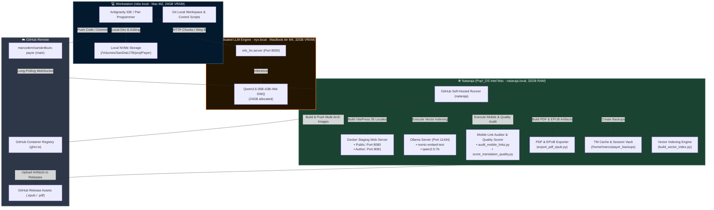

# System Architecture Specification

## 1. Executive Summary

The **Payer Sanskritkurs Translation & Publishing System** is a distributed, multi-node architecture designed for high-performance AI translation, continuous quality assurance, automated web publishing, and vector-search indexing.

The system decouples **interactive development/pair-programming**, **heavy LLM inference**, and **CI/CD background builds** across three dedicated nodes in the local network.

> [!IMPORTANT]
> All automated translation tasks adhere strictly to the **Single-Process Constraint** (`ps aux | grep lan_translate`) to guarantee 100% VRAM efficiency and maximum throughput (~20 t/s) on `nyx.local`.

---

## 2. Distributed System Topology (Mermaid Diagram)

---

## 3. Node Specifications & Role Distribution

| Node | OS & Hardware | Primary Responsibilities | Network Endpoints |
| :--- | :--- | :--- | :--- |
| **nike.local** | macOS (Apple Silicon M2, 24GB Unified Memory/VRAM) | • Interactive Pair Programming with Antigravity IDE • Code Editing & Git Control • Translation Runner Trigger (`lan_translate.py`) | Local NVMe (`/Volumes/SanDisk1TB/proj/Payer`) |
| **nyx.local** | macOS (MacBook Air M4, 32GB Unified Memory/VRAM) | • Dedicated 35B Heavy LLM Mass Translation Server • Zero-Cost Local Inference (~20 tokens/sec) | `http://nyx.local:8000` |
| **nataraja.local** | Pop!_OS 24.04 Linux (Intel Core i7-8700B, 32GB RAM, NVMe SSD) | • GitHub Self-Hosted Runner (`nataraja`) • VitePress 35-Locale Quality Gate & Build Server • Local Live-Staging Container Host (Public :8080, Author :8081) • Mobile Link Auditor & Quality Benchmark Engine • Automated PDF & EPUB Course Book Exporter • Auxiliary Ollama LLM & Vector Search Engine • Automated TM & Session Vault Manager | • SSH: `marco@nataraja.local` • Public Staging: `http://nataraja.local:8080` • Author Staging: `http://nataraja.local:8081` • Ollama: `http://nataraja.local:11434` |

---

## 4. Pipeline Execution Workflows

### 4.1. AI Mass Translation Pipeline (Weg B Strategy)
- **Sequential 1-to-1 Translation**: Strict single-process rule to prevent VRAM context-switching stalls on `nyx.local`.
- **Completion Criteria**: 100% clean files (136/136) with 0 fallbacks before transitioning to the next language.
- **Priority Queue Overrides**: Priority order configured via `priority_override = ["en", "bg"]` in `generate_report.py`, automatically falling back to highest completion % descending.
- **Force Session (Weg B)**: Full fresh translations (`-f`) bypass legacy cached fallbacks.

### 4.2. CI/CD Quality Gate & Staging Pipeline (`ci.yml`)
When code is pushed to `main`:
1. **GitHub Runner Event**: GitHub triggers `ci.yml` via outbound long-polling to `nataraja`.
2. **Integrity Validation**: Runs `python3 scripts/pre_push_check.py` to enforce zero-HTML, YAML frontmatter, container boundaries (`::::`), and QA dropdown parity.
3. **35-Locale Site Generation**: Compiles VitePress for both `public` and `author` environments utilizing 32GB physical RAM on Nataraja.
4. **Live Staging Containers**: Restarts Nginx containers `payer-staging` (Port 8080) and `payer-author-staging` (Port 8081).
5. **Mobile & Link Audit**: Executes `scripts/audit_mobile_links.py` to verify internal links and PWA manifest integrity.
6. **Quality Benchmark**: Executes `scripts/score_translation_quality.py` to compute Devanāgarī preservation ratios.
7. **Auxiliary QA & Remnant Scan**: Executes `scripts/qa_german_remnants.py`.
8. **Vector Indexing**: Runs `scripts/build_vector_index.py` against Ollama `nomic-embed-text` on Nataraja.
9. **Vault Archiving**: Archives `.payer/tm/` to `/home/marco/payer_backups/tm_backup_<timestamp>.tar.gz`.

### 4.3. Release Asset Pipeline (`deploy.yml`)
When an official release tag (e.g. `v1.6.5`) is pushed:
1. Multi-platform Docker builds for `linux/amd64` and `linux/arm64` pushed to `ghcr.io`.
2. PDF & EPUB exporter (`scripts/export_pdf_epub.py`) builds consolidated course books.
3. Uploads generated `.epub` and `.pdf` files directly as GitHub Release Assets via `gh release upload`.

---

## 5. Architectural Log & Change History

| Date | Category | Description | Impact |
| :--- | :--- | :--- | :--- |
| **2026-08-11** | **Artifact Exporter** | Added automated PDF & EPUB exporter (`export_pdf_epub.py`) and release asset uploader. | Publishes EPUB & PDF course books on GitHub Releases. |
| **2026-08-11** | **Auditing & QA** | Added Mobile Link Auditor (`audit_mobile_links.py`) and Quality Scorer (`score_translation_quality.py`). | Automated link, PWA, and Devanāgarī preservation scoring. |
| **2026-08-11** | **Staging Server** | Deployed `payer-author-staging` container on port 8081. | Provides dedicated author/QA staging host alongside public site on 8080. |
| **2026-08-11** | **Node Hardware** | Specified `nyx.local` as MacBook Air M4 (32GB Unified Memory/VRAM). | Documented exact M4 generation architecture. |
| **2026-08-11** | **Workstation** | Identified primary Mac workstation as `nike.local` (M2, 24GB VRAM). | Documented node hostname and Apple Silicon M2 specs. |
| **2026-08-11** | **Infrastructure** | Added `nataraja` (Pop!_OS Intel Mac 32GB RAM) as dedicated GitHub Self-Hosted Runner. | Shifted site builds and Docker multi-arch builds off Workstation Mac. |
| **2026-08-11** | **Staging Suite** | Integrated Local Staging Web Server (`http://nataraja.local:8080`) into Nataraja CI workflow. | Enables instant local network preview of built site on any device. |
| **2026-08-11** | **AI Infrastructure** | Provisioned Ollama (`nomic-embed-text`, `qwen2.5:7b`) on Nataraja. | Offloaded embeddings & secondary checks from `nyx.local:8000`. |
| **2026-08-11** | **Backup System** | Activated automated TM Cache Vault archiving on Nataraja. | Guaranteed 100% recovery safety for translation memory files. |
| **2026-08-11** | **Pipeline Logic** | Configured `generate_report.py` priority queue sequence (`EN` ➔ `BG`). | Enforced exact Weg B sequence override requested by user. |
