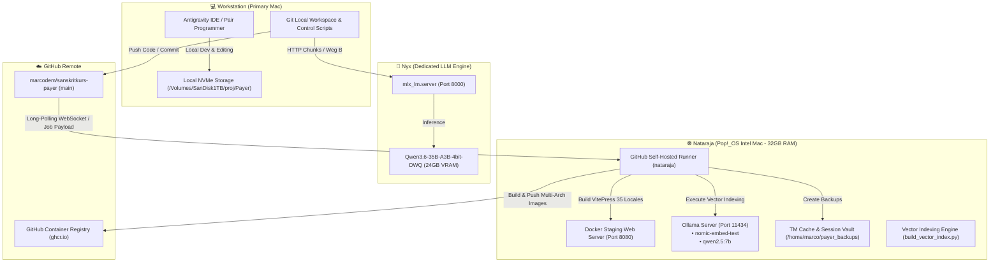

# System Architecture Specification

## 1. Executive Summary

The **Payer Sanskritkurs Translation & Publishing System** is a distributed, multi-node architecture designed for high-performance AI translation, continuous quality assurance, automated web publishing, and vector-search indexing.

The system decouples **interactive development/pair-programming**, **heavy LLM inference**, and **CI/CD background builds** across three dedicated nodes in the local network.

---

## 2. Distributed System Topology (Mermaid Diagram)

---

## 3. Node Specifications & Role Distribution

| Node | OS & Hardware | Primary Responsibilities | Network Endpoints |
| :--- | :--- | :--- | :--- |
| **Workstation Mac** | macOS (Apple Silicon) | • Interactive Pair Programming with Antigravity IDE • Code Editing & Git Control • Translation Runner Trigger (`lan_translate.py`) | Local NVMe (`/Volumes/SanDisk1TB/proj/Payer`) |
| **Nyx.local** | macOS (Apple Silicon / Unified Memory) | • Dedicated 35B Heavy LLM Mass Translation Server • Zero-Cost Local Inference (~20 tokens/sec) | `http://nyx.local:8000` |
| **Nataraja.local** | Pop!_OS 24.04 Linux (Intel Core i7-8700B, 32GB RAM, NVMe SSD) | • GitHub Self-Hosted Runner (`nataraja`) • VitePress 35-Locale Quality Gate & Build Server • Local Live-Staging Container Host (Nginx) • Auxiliary Ollama LLM & Vector Search Engine • Automated TM & Session Vault Manager | • SSH: `marco@nataraja.local` • Staging Web: `http://nataraja.local:8080` • Ollama: `http://nataraja.local:11434` |

---

## 4. Pipeline Execution Workflows

### 4.1. AI Mass Translation Pipeline (Weg B Strategy)
- **Sequential 1-to-1 Translation**: Strict single-process rule (`ps aux | grep lan_translate`) to prevent VRAM context-switching stalls on `nyx.local`.
- **Completion Criteria**: 100% clean files (136/136) with 0 fallbacks before transitioning to the next language.
- **Priority Queue Overrides**: Priority order configured via `priority_override = ["en", "bg"]` in `generate_report.py`, automatically falling back to highest completion % descending.
- **Force Session (Weg B)**: Full fresh translations (`-f`) bypass legacy cached fallbacks.

### 4.2. CI/CD Quality Gate & Staging Pipeline (`ci.yml`)
When code is pushed to `main`:
1. **GitHub Runner Event**: GitHub triggers `ci.yml` via outbound long-polling to `nataraja`.
2. **Integrity Validation**: Runs `python3 scripts/pre_push_check.py` to enforce zero-HTML, YAML frontmatter, container boundaries (`::::`), and QA dropdown parity.
3. **35-Locale Site Generation**: Compiles VitePress for both `public` and `author` environments utilizing 32GB physical RAM on Nataraja.
4. **Live Staging Container**: Restarts Nginx container `payer-staging` serving the built site at `http://nataraja.local:8080`.
5. **Auxiliary QA & Remnant Scan**: Executes `scripts/qa_german_remnants.py`.
6. **Vector Indexing**: Runs `scripts/build_vector_index.py` against Ollama `nomic-embed-text` on Nataraja.
7. **Vault Archiving**: Archives `.payer/tm/` to `/home/marco/payer_backups/tm_backup_<timestamp>.tar.gz`.

---

## 5. Architectural Log & Change History

| Date | Category | Description | Impact |
| :--- | :--- | :--- | :--- |
| **2026-08-11** | **Infrastructure** | Added `nataraja` (Pop!_OS Intel Mac 32GB RAM) as dedicated GitHub Self-Hosted Runner. | Shifted site builds and Docker multi-arch builds off Workstation Mac. |
| **2026-08-11** | **Staging Suite** | Integrated Local Staging Web Server (`http://nataraja.local:8080`) into Nataraja CI workflow. | Enables instant local network preview of built site on any device. |
| **2026-08-11** | **AI Infrastructure** | Provisioned Ollama (`nomic-embed-text`, `qwen2.5:7b`) on Nataraja. | Offloaded embeddings & secondary checks from `nyx.local:8000`. |
| **2026-08-11** | **Backup System** | Activated automated TM Cache Vault archiving on Nataraja. | Guaranteed 100% recovery safety for translation memory files. |
| **2026-08-11** | **Pipeline Logic** | Configured `generate_report.py` priority queue sequence (`EN` ➔ `BG`). | Enforced exact Weg B sequence override requested by user. |
