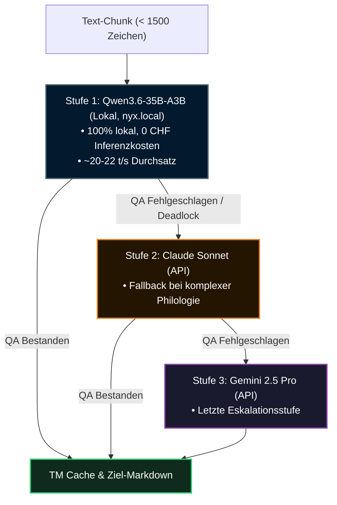

# 🤖 KI-Translations-Pipeline & Weg B

## 1. Motivation & Strategie

Die Übersetzung eines 60-teiligen, hochkomplexen Sanskrit-Lehrbuchs in über 38 Zielsprachen erfordert ein System, das akademische Präzision, philologische Konsistenz und Kosteneffizienz vereint. 

Das Projekt verfolgt hierbei die **Weg-B-Strategie**:
- **Zero-Cost-Inferenz:** Lokale Ausführung moderner Open-Weights-Modelle auf sparsamer Consumer-Hardware (Apple Silicon).
- **Format-Integrität:** Deterministische Bewahrung von Markdown-Syntax, Tabellen, Devanāgarī-Zeichen und Metadaten.
- **Translation Memory (TM):** Kryptografisches Caching auf Chunk-Ebene zur Vermeidung redundanter Rechenzeit.

---

## 2. Die 3-Stufen-Modellhierarchie

Um Deadlocks zu überwinden und höchste Qualität zu garantieren, ist die Inferenz hierarchisch gegliedert:



---

## 3. Translation Memory (TM) Architektur

Jeder Zielsprache ist ein deterministischer Key-Value-Cache zugeordnet:

1. **Chunk-Hashing:**
   Jeder deutsche Quelltext-Chunk wird bereinigt und via MD5 gehasht:
   ```python
   chunk_hash = hashlib.md5(chunk.strip().encode('utf-8')).hexdigest()
   ```
2. **Persistenz (`.payer/tm/<lang>.json`):**
   - Schlüssel: 32-Zeichen MD5-Hex-String.
   - Wert: Validierter übersetzter Zieltext.
   - Updates erfolgen unmittelbar nach erfolgreicher Validierung atomar auf die Festplatte.
3. **Validierung vor Cache-Übernahme:**
   - Ein Eintrag darf niemals mit `ERROR:` beginnen.
   - Der Eintrag muss den Residuen-Scanner (`scan_german_residues`) mit 0 Beanstandungen bestehen.
4. **Frontmatter-Verarbeitung:**
   YAML-Header (`title`, `description`, `next`, `prev`) werden in einem einzigen atomaren Durchlauf übersetzt und separat im TM abgelegt.

---

## 4. Devanāgarī- & Syntax-Schutz

Um zu verhindern, dass LLMs Sanskrit-Begriffe versehentlich in Zielsprachen übersetzen oder Devanāgarī-Kombinationen zerstören, setzt die Pipeline auf strikte syntaktische Schutzfilter:

- **Devanāgarī-Tags:**
  Devanāgarī-Sequenzen werden in `⟪...⟫` gekapselt. Prompts instruieren das Modell, den Inhalt dieser Klammern unverändert zu kopieren.
- **Signalrot-Markierungen (`:sig[...]`):**
  Hervorhebungen von Wortbestandteilen dürfen ausschließlich auf Devanāgarī angewendet werden, niemals auf lateinischen Text.
- **Grammatik-Boxen (`::: grammar-box`):**
  Verschachtelungen inkrementieren die Doppelpunkte (`:::: grammar-box`). Beispiele und Erläuterungen verbleiben außerhalb der Box in `::: indent`.

---

## 5. Deadlock-Handling & Fehlerbehebung

Bei wiederholten QA-Ablehnungen greift die automatisierte Recovery-Routine:

1. **TM-Bereinigung (`scripts/scratch/llm_fix_tms.py`):**
   Tainted Chunks, fehlerhafte Token-Reste oder historische Fehlübersetzungen werden gezielt aus `.payer/tm/<lang>.json` entfernt.
2. **Force-Modus:**
   Neuberechnung betroffener Dateien mit adaptiver Prompt-Modulation via `lan_translate.py --force`.
