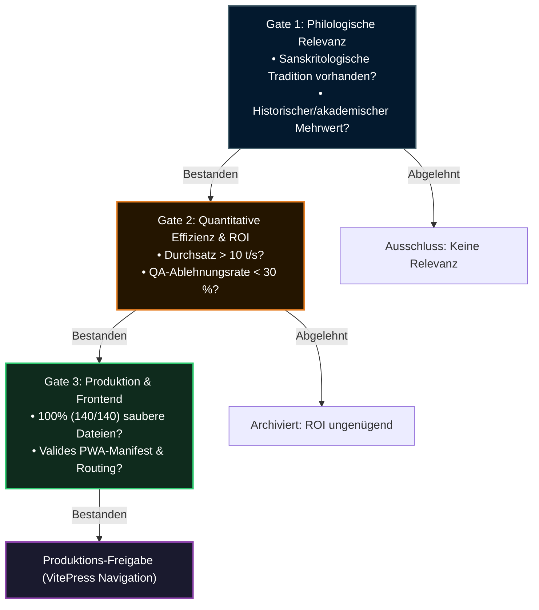

# 🌐 Sprachauswahl & Ausschlusskriterien

## 1. Empirischer Hintergrund & 248,3-Stunden-Benchmark

Zwischen dem **28. August und 6. September 2026** lief die Übersetzungspipeline autonom über **248,3 kumulierte GPU-Stunden** auf `nyx.local` (`Qwen3.6-35B-A3B-4bit` auf Apple Silicon M4).

Dabei wurden 2.710 Markdown-Dateien für über 35 Zielsprachen verarbeitet. Die Messdaten zeigten eine ausgeprägte operationelle Asymmetrie:
- **71,5 % der gesamten GPU-Rechenzeit (177,6 Stunden)** entfielen auf 10 Low-Resource-Sprachen, die unter hohen QA-Ablehnungsraten (> 50 % bis 88 %) litten.
- Im Gegensatz dazu konnten etablierte Zielsprachen nach Behebung von Punctuation-Regex- und Unicode-Stripping-Fehlern innerhalb weniger Minuten fehlerfrei abgeschlossen werden. Die Anzahl vollständig fertiger Sprachen stieg rasch von 7 auf über 19 und schließlich auf 35+ Sprachen (jeweils 140/140 Dateien).

Um unbegrenzte Ressourcenausschöpfung zu verhindern und die wissenschaftliche Qualität zu sichern, wurde das **3-Stufen-Ausschlussframework** eingeführt.

---

## 2. Rechenzeit-Verteilung der Engpass-Sprachen

Die folgende Tabelle dokumentiert die ressourcenintensivsten Zielsprachen während des 10-tägigen Dauerlaufs vor Einführung der Ausschlusskriterien:

| Locale | Sprache | Sprachfamilie | Rechenzeit | Saubere Dateien | Ablehnungen / QA | Quote | Bewertung |
| :--- | :--- | :--- | :---: | :---: | :---: | :---: | :--- |
| `et` | Estnisch | Uralisch (Finno-Ugrisch) | 32,7 h | 26 / 140 | 114 | 18,6 % | Morphologieversagen; durch QA gestoppt |
| `am` | Amharisch | Semitisch (Äthiosemitisch) | 32,1 h | 63 / 140 | 77 | 45,0 % | Hoher Sub-Word Token Penalty; sehr langsam |
| `zu` | isiZulu | Niger-Kongo (Bantu) | 17,9 h | 70 / 140 | 70 | 50,0 % | Kein philologischer Bezug; hohe Repetition |
| `cop` | Koptisch | Afroasiatisch (liturgisch) | 14,6 h | 16 / 140 | 124 | 11,4 % | Extreme Vokabular-Lücken; Halluzination |
| `sl` | Slowenisch | Indogermanisch (Slawisch) | 14,3 h | 56 / 140 | 84 | 40,0 % | Grammatik-Terminologie unpräzise |
| `si` | Singhalesisch | Indoarisch | 14,1 h | 60 / 140 | 80 | 42,9 % | Komplexe Schrift-Latenzen |
| `ka` | Georgisch | Kartwelisch | 13,4 h | 61 / 140 | 79 | 43,6 % | Kasus-Fehlausrichtungen |
| `hy` | Armenisch | Indogermanisch (Armenisch) | 13,4 h | 65 / 140 | 75 | 46,4 % | Begriffliche Verschiebungen |
| `sv` | Schwedisch | Indogermanisch (Germanisch) | 13,3 h | 53 / 140 | 87 | 37,9 % | False-Positive QA-Stopps auf Latinismen |
| `te` | Telugu | Dravidisch | 11,8 h | 68 / 140 | 72 | 48,6 % | Komplexe Sandhi-Verzögerungen |
| **Summe** | **Top 10** | — | **177,6 h** | — | — | — | **71,5 % der Cluster-Laufzeit** |

---

## 3. Ursachen der Engpässe

1. **Sub-Word-Tokenisierung & Tokenizer-Penalty:**
   Open-Weights-Modelle besitzen Tokenizer, die primär auf Englisch, Chinesisch und europäische Hauptsprachen trainiert sind. Bei Sprachen wie `am`, `cop` oder `zu` werden Wörter in 4 bis 8 Byte-Fallback-Tokens zerlegt. Dadurch sinkt die Generierungsgeschwindigkeit von ~22 t/s auf 3–6 t/s ab, was den Rechenzeitbedarf um den Faktor 4x bis 6x erhöht.
2. **Fehlende digitalisierte Fachgrammatiken:**
   Die Übersetzung deutscher philologischer Sanskrit-Traktate in Sprachen ohne etablierte sanskritologische Fachliteratur führt bei LLMs zu künstlichen Wortneuschöpfungen oder semantischen Entgleisungen.
3. **Cache/QA-Desynchronisation:**
   Wenn Generierungsfilter toleranter sind als das Prüfskript `translation_qa.py`, gelangen unvollständige Chunks in das Translation Memory (`.payer/tm/`). Der Runner ruft diese wiederholt ab und gerät in Endlosschleifen.

---

## 4. Das 3-Stufen-Ausschlussframework

---

## 5. Status der Zielsprachen

- **100 % fertiggestellt (35+ Sprachen, 140/140 Dateien):**
  Deutsch (`de`), Englisch (`en`), Französisch (`fr`), Italienisch (`it`), Spanisch (`es`), Russisch (`ru`), Ukrainisch (`uk`), Hindi (`hi`), Tamil (`ta`), Punjabi (`pa`), Latein (`la`), Rumantsch Grischun (`rm`), Rumänisch (`ro`), Arabisch (`ar`), Hebräisch (`he`), Indonesisch (`id`), Chinesisch (`zh-CN`, `zh`), Neugriechisch (`el`), Altgriechisch (`grc`), Thai (`th`), Finnisch (`fi`), Ungarisch (`hu`), Persisch (`fa`), Niederländisch (`nl`), Afrikaans (`af`), Litauisch (`lt`), Serbokroatisch (`sh`), Albanisch (`sq`), Portugiesisch (`pt`), Bulgarisch (`bg`), Türkisch (`tr`), Vietnamesisch (`vi`), Dänisch (`da`), Norwegisch (`no`), Schwedisch (`sv`), Isländisch (`is`).
- **Gesperrt gemäß Gate 1 / 2:**
  Koptisch (`cop`), isiZulu (`zu`), Estnisch (`et`).
