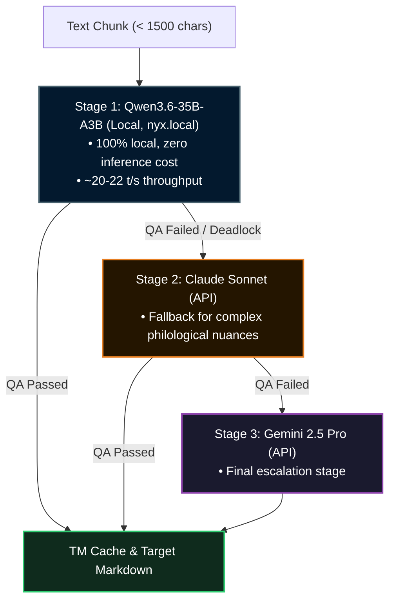

# 🤖 AI Translation Pipeline & Weg B Strategy

## 1. Motivation & Approach

Translating a 60-lesson scholarly Sanskrit textbook into over 38 target languages requires a methodology that balances academic rigor, philological consistency, and operational cost efficiency.

The project implements the **Weg B Strategy**:
- **Zero-Cost Inference:** Local execution of open-weights models on consumer-grade hardware (Apple Silicon).
- **Format Integrity:** Deterministic preservation of Markdown syntax, tables, Devanāgarī scripts, and frontmatter metadata.
- **Translation Memory (TM):** Cryptographic chunk-level caching to eliminate redundant compute cycles.

---

## 2. 3-Stage Model Hierarchy

To overcome edge-case deadlocks while ensuring publication-grade output, inference follows a tiered fallback structure:



---

## 3. Translation Memory (TM) Architecture

Each target language maintains a deterministic key-value cache:

1. **Cryptographic Chunk Hashing:**
   Each German source chunk is normalized and hashed using MD5:
   ```python
   chunk_hash = hashlib.md5(chunk.strip().encode('utf-8')).hexdigest()
   ```
2. **Persistent Storage (`.payer/tm/<lang>.json`):**
   - Key: 32-character MD5 hexadecimal string.
   - Value: Validated target translation string.
   - Disk writes occur atomically immediately after a chunk passes validation.
3. **Cache Validation Criteria:**
   - Entries must never start with `ERROR:`.
   - The chunk must pass the residue scanner (`scan_german_residues`) with 0 detected artifacts.
4. **Frontmatter Processing:**
   YAML headers (`title`, `description`, `next`, `prev`) are translated in a single atomic pass and cached separately.

---

## 4. Devanāgarī & Syntax Protection

To prevent LLMs from erroneously translating Sanskrit terms or corrupting Devanāgarī conjuncts, the pipeline enforces strict syntactic protection boundaries:

- **Devanāgarī Tags:**
  Devanāgarī text spans are encapsulated in `⟪...⟫`. Prompts instruct the model to reproduce bracketed contents verbatim.
- **Signal Red Markers (`:sig[...]`):**
  Highlighting inflectional suffixes and morphemes is permitted exclusively on Devanāgarī text, never on Latin transliterations.
- **Grammar Box Boundaries (`::: grammar-box`):**
  Nested structures increment colon counts (`:::: grammar-box`). Examples and narrative glosses remain outside boxes inside `::: indent`.

---

## 5. Deadlock Recovery & Maintenance

When files trigger repetitive QA rejections, an autonomous recovery routine resolves the block:

1. **TM Residue Purge (`scripts/scratch/llm_fix_tms.py`):**
   Tainted chunks and obsolete tokens are purged from `.payer/tm/<lang>.json`.
2. **Force-Mode Resumption:**
   Regenerating affected files with adaptive prompt adjustment via `lan_translate.py --force`.
