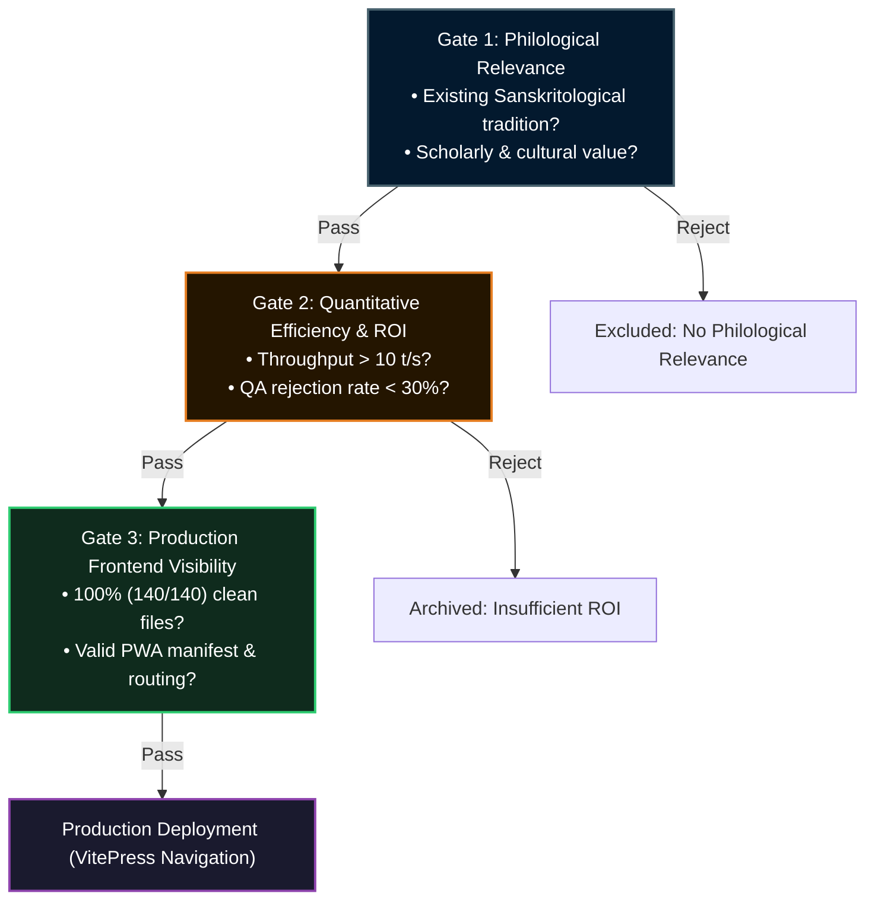

# 🌐 Language Selection & Exclusion Criteria

## 1. Empirical Context & 248.3-Hour Benchmark

Between **August 28 and September 6, 2026**, the automated translation pipeline ran continuously for **248.3 cumulative GPU hours** using local inference on `nyx.local` (`Qwen3.6-35B-A3B-4bit` on Apple Silicon M4).

Over 2,710 Markdown files across 35+ target languages were processed. The empirical telemetry revealed a major operational asymmetry:
- **71.5% of total GPU compute (177.6 hours)** was consumed by 10 low-resource languages experiencing severe QA rejection rates (> 50% to 88%).
- Conversely, once punctuation regex and Unicode stripping synchronization issues were fixed, established target languages completed cleanly within minutes, advancing the suite of fully verified languages from 7 to 19, and eventually to 35+ locales (140/140 files each).

To prevent open-ended resource exhaustion and safeguard academic standards, the **Three-Tier Exclusion Framework** was established.

---

## 2. Compute Distribution Across Bottleneck Languages

The following table records the top time-consuming languages during the 10-day continuous run prior to the exclusion policy:

| Locale | Language | Family / Type | Compute Time | Clean Files | Rejected / QA | Completion Rate | Operational Assessment |
| :--- | :--- | :--- | :---: | :---: | :---: | :---: | :--- |
| `et` | Estonian | Uralic (Finno-Ugric) | 32.7 h | 26 / 140 | 114 | 18.6% | Morphological failure; stopped by QA |
| `am` | Amharic | Semitic (Ethiopic) | 32.1 h | 63 / 140 | 77 | 45.0% | Heavy sub-word tokenization penalty; slow |
| `zu` | isiZulu | Niger-Congo (Bantu) | 17.9 h | 70 / 140 | 70 | 50.0% | No philological nexus; high repetition rate |
| `cop` | Coptic | Afroasiatic (liturgical) | 14.6 h | 16 / 140 | 124 | 11.4% | Severe vocabulary sparsity; hallucinations |
| `sl` | Slovenian | Indo-European (Slavic) | 14.3 h | 56 / 140 | 84 | 40.0% | Grammar terminology ambiguity |
| `si` | Sinhala | Indo-Aryan | 14.1 h | 60 / 140 | 80 | 42.9% | Script rendering overhead; high token latency |
| `ka` | Georgian | Kartvelian | 13.4 h | 61 / 140 | 79 | 43.6% | Agglutinative case misalignment |
| `hy` | Armenian | Indo-European (Armenian) | 13.4 h | 65 / 140 | 75 | 46.4% | Terminological drift |
| `sv` | Swedish | Indo-European (Germanic) | 13.3 h | 53 / 140 | 87 | 37.9% | False-positive QA stops on Latinate roots |
| `te` | Telugu | Dravidian | 11.8 h | 68 / 140 | 72 | 48.6% | Complex sandhi rendering delays |
| **Sum** | **Top 10** | — | **177.6 h** | — | — | — | **71.5% of total cluster runtime** |

---

## 3. Root Causes of the Automated Bottlenecks

1. **Vocabulary Sparsity & Sub-Word Tokenization Penalty:**
   Open-weights LLMs are tokenizer-optimized for English, Chinese, and major European languages. For low-resource languages (`cop`, `am`, `zu`), words are fragmented into 4 to 8 byte-fallback tokens. Generation speeds collapse from ~22 t/s down to 3–6 t/s, increasing compute requirements by a factor of 4x to 6x.
2. **Absence of Digitized Reference Grammars:**
   Translating complex German treatises on Sanskrit grammar into languages that lack established Sanskritological scholarship forces models to invent artificial neologisms or regress into loan translations.
3. **Cache/QA Desynchronization Loops:**
   When generation filters are less stringent than the verification script (`translation_qa.py`), tainted chunks enter the Translation Memory (`.payer/tm/`). The runner repeatedly re-injects these cached chunks, causing infinite validation loops.

---

## 4. The Three-Tier Exclusion Framework

---

## 5. Current Locale Status

- **100% Completed (35+ Locales, 140/140 files each):**
  German (`de`), English (`en`), French (`fr`), Italian (`it`), Spanish (`es`), Russian (`ru`), Ukrainian (`uk`), Hindi (`hi`), Tamil (`ta`), Punjabi (`pa`), Latin (`la`), Romansh (`rm`), Romanian (`ro`), Arabic (`ar`), Hebrew (`he`), Indonesian (`id`), Chinese (`zh-CN`, `zh`), Modern Greek (`el`), Ancient Greek (`grc`), Thai (`th`), Finnish (`fi`), Hungarian (`hu`), Persian (`fa`), Dutch (`nl`), Afrikaans (`af`), Lithuanian (`lt`), Serbo-Croatian (`sh`), Albanian (`sq`), Portuguese (`pt`), Bulgarian (`bg`), Turkish (`tr`), Vietnamese (`vi`), Danish (`da`), Norwegian (`no`), Swedish (`sv`), Icelandic (`is`).
- **Excluded by Gate 1 / 2:**
  Coptic (`cop`), isiZulu (`zu`), Estonian (`et`).
